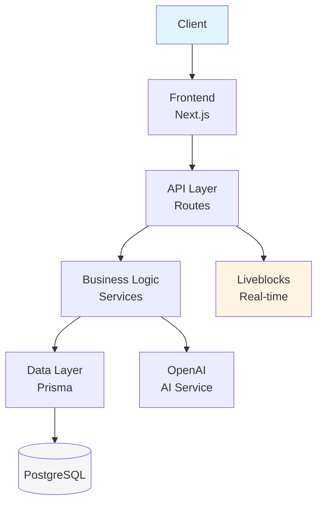
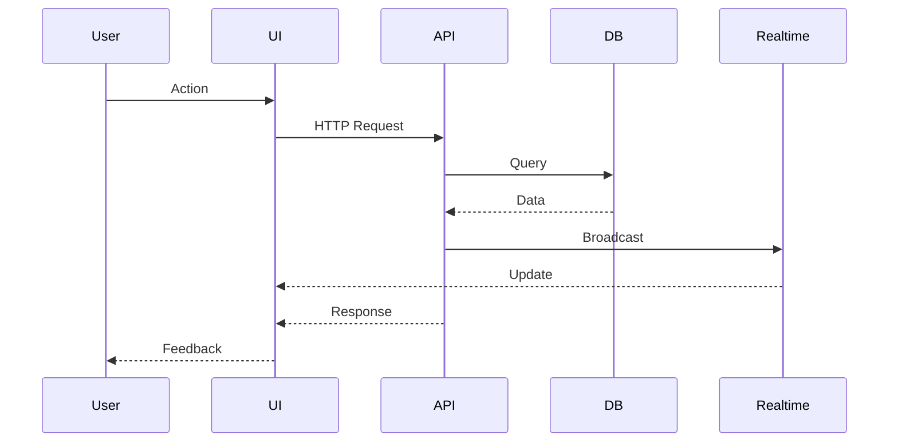

# MarqDexorative Work System - Architecture Documentation

This directory contains comprehensive architecture documentation for the MarqDexorative Work System.

## 📋 Table of Contents

1. [System Architecture](./system-architecture.md) - High-level system design and technology stack
2. [Database Schema](./database-schema.md) - Entity relationships and data models
3. [Frontend Architecture](./frontend-architecture.md) - Component hierarchy and state management
4. [API Architecture](./api-architecture.md) - API routes and endpoint documentation

## 🏗️ Quick Overview

### Technology Stack

**Frontend**:
- Next.js 16 (App Router)
- React 19
- Tailwind CSS
- Radix UI
- Liveblocks (real-time)

**Backend**:
- Next.js API Routes
- Prisma ORM
- PostgreSQL
- NextAuth.js v5

**External Services**:
- OpenAI API (AI generation)
- Liveblocks (real-time collaboration)

### System Architecture

```
┌─────────────────────────────────────────────────────────────┐
│                        Client Layer                          │
│                   Web Browser / Desktop                      │
└─────────────────────────────────────────────────────────────┘
                              │
┌─────────────────────────────────────────────────────────────┐
│                      Frontend Layer                          │
│           Next.js 16 App Router + React Components           │
└─────────────────────────────────────────────────────────────┘
                              │
┌─────────────────────────────────────────────────────────────┐
│                       API Layer                              │
│           RESTful API Routes + Server Actions                │
└─────────────────────────────────────────────────────────────┘
                              │
┌─────────────────────────────────────────────────────────────┐
│                     Business Logic                           │
│  RBAC | Notifications | Activity Logging | Version Control   │
└─────────────────────────────────────────────────────────────┘
                              │
┌─────────────────────────────────────────────────────────────┐
│                      Data Layer                              │
│              Prisma ORM + PostgreSQL Database                │
└─────────────────────────────────────────────────────────────┘
                              │
┌─────────────────────────────────────────────────────────────┐
│                   External Services                         │
│        Liveblocks (Real-time) | OpenAI (AI) | Email         │
└─────────────────────────────────────────────────────────────┘
```

## 📊 Architecture Diagrams

### System Layers



### Data Flow



## 🔑 Key Features

### 1. Team & Project Management
- Hierarchical structure: Teams → Projects → Files
- Role-based access control (ADMIN, EDITOR, VIEWER)
- Member invitation and management

### 2. Real-time Collaboration
- Liveblocks integration for multi-user editing
- WebSocket-based real-time updates
- Presence indicators
- Conflict resolution

### 3. File Management
- Markdown editing with syntax highlighting
- Auto-save (30-second intervals)
- Complete version history
- Manual version snapshots
- Import from Word documents

### 4. Comments & Mentions
- Inline comments with line numbers
- @mention system
- Real-time notifications
- Comment threading

### 5. Notifications
- Real-time notification center
- Multiple notification types:
  - MENTIONS
  - FILE_CHANGED
  - TEAM_INVITATION
  - PROJECT_UPDATED
- Mark as read functionality

### 6. Activity Logging
- Comprehensive audit trail
- User activity tracking
- Project/file-level activity history

### 7. AI Integration
- User-provided OpenAI API keys
- Template-based content generation
- Custom AI endpoint support
- Context-aware generation

## 🗄️ Database Models

### Core Entities
- **User** - User profiles with AI configuration
- **Team** - Team entities
- **Project** - Projects within teams
- **File** - Markdown files
- **FileVersion** - File history
- **Comment** - File comments
- **Mention** - @mentions in comments
- **Notification** - User notifications
- **ActivityLog** - Audit trail
- **Template** - Document templates

### Relationships
- Users ↔ Teams (many-to-many via TeamMember)
- Users ↔ Projects (many-to-many via ProjectMember)
- Teams → Projects (one-to-many)
- Projects → Files (one-to-many)
- Files → Comments (one-to-many)
- Files → FileVersions (one-to-many)

## 🔐 Security Features

### Authentication
- NextAuth.js v5 with JWT
- bcrypt password hashing
- Secure session management
- Email verification support

### Authorization
- Role-based access control (RBAC)
- Resource-level permissions
- API endpoint access checks
- Team/project role hierarchy

### Data Protection
- SQL injection prevention (Prisma)
- XSS protection (React sanitization)
- API key encryption
- HTTPS-only in production

## 📈 Performance Optimizations

### Frontend
- Code splitting with App Router
- Lazy loading for components
- Optimistic updates
- Debounced auto-save
- Image optimization

### Backend
- Database connection pooling
- Efficient Prisma queries
- Proper indexing
- Response caching

### Real-time
- WebSocket connection pooling
- Optimistic updates
- Conflict resolution

## 🚀 Deployment

### Development
```bash
npm install
npm run dev
# Runs on http://localhost:3002
```

### Production (Recommended)
- **Frontend**: Vercel (Next.js optimized)
- **Database**: Supabase or Amazon RDS (PostgreSQL)
- **Real-time**: Liveblocks Cloud
- **Email**: Sendgrid or AWS SES

### Environment Variables
```bash
# Database
DATABASE_URL="postgresql://..."

# Authentication
NEXTAUTH_URL="https://yourdomain.com"
NEXTAUTH_SECRET="..."

# Real-time
LIVEBLOCKS_SECRET="..."
LIVEBLOCKS_PUBLIC_KEY="..."

# Encryption
ENCRYPTION_KEY="32-character-key"
```

## 📚 Documentation Structure

```
docs/
├── architecture/
│   ├── README.md (this file)
│   ├── system-architecture.md    # High-level system design
│   ├── database-schema.md        # Database ER diagrams
│   ├── frontend-architecture.md  # Component hierarchy
│   └── api-architecture.md       # API endpoint documentation
└── api/                          # API documentation (future)
```

## 🔄 Development Workflow

### 1. Feature Development
1. Create feature branch
2. Update architecture docs if needed
3. Implement backend (API routes)
4. Implement frontend (components/pages)
5. Test with multiple users
6. Update documentation
7. Create pull request

### 2. Code Review Checklist
- [ ] Architecture patterns followed
- [ ] Security best practices applied
- [ ] RBAC permissions checked
- [ ] Error handling comprehensive
- [ ] Notifications created for relevant actions
- [ ] Activity logs updated
- [ ] Database queries optimized
- [ ] Component structure maintained

### 3. Testing Strategy
- **Unit Tests**: Business logic, utilities
- **Integration Tests**: API endpoints
- **E2E Tests**: Critical user flows
- **Manual Tests**: Multi-user collaboration

## 🎯 Future Enhancements

### Planned Features
1. **Search** - Full-text search across files
2. **File Folders** - Hierarchical file organization
3. **Advanced Permissions** - Fine-grained access control
4. **Webhooks** - External integrations
5. **Analytics** - Usage metrics and insights
6. **Mobile Apps** - Native iOS/Android apps
7. **Offline Mode** - Service worker support
8. **Advanced AI** - More AI-powered features

### Technical Improvements
1. **Database Sharding** - Scale for large teams
2. **Caching Layer** - Redis for performance
3. **Message Queue** - Background job processing
4. **Read Replicas** - Distribute read load
5. **CDN** - Static asset delivery

## 📞 Support & Contributing

### Getting Help
- Review architecture documentation
- Check API endpoint docs
- Review component patterns
- Examine database relationships

### Contributing
1. Follow architecture patterns
2. Update documentation
3. Maintain consistency
4. Test thoroughly
5. Code review required

## 📝 License

[Your License Here]

---

**Last Updated**: 2026-01-29
**Version**: 1.0.0
**Maintainer**: Development Team
