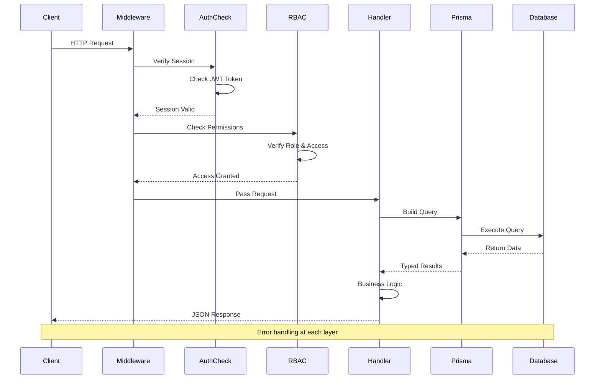

# API Architecture - Routes & Endpoints

## API Routes Overview

```mermaid
graph TB
    subgraph "Authentication API"
        AuthRegister[POST /api/auth/register<br/>Create new user]
        AuthLogin[POST /api/auth/login<br/>Authenticate user]
        AuthSession[GET /api/auth/session<br/>Get current session]
    end

    subgraph "Team API"
        TeamsList[GET /api/teams<br/>List all teams]
        TeamsCreate[POST /api/teams<br/>Create team]
        TeamsDetail[GET /api/teams/[id]<br/>Get team details]
        TeamsUpdate[PATCH /api/teams/[id]<br/>Update team]
        TeamsDelete[DELETE /api/teams/[id]<br/>Delete team]
        TeamsMembers[GET /api/teams/[id]/members<br/>List members]
        TeamsAddMember[POST /api/teams/[id]/members<br/>Add member]
    end

    subgraph "Project API"
        ProjectsList[GET /api/projects<br/>List projects]
        ProjectsCreate[POST /api/projects<br/>Create project]
        ProjectsDetail[GET /api/projects/[id]<br/>Get project]
        ProjectsUpdate[PATCH /api/projects/[id]<br/>Update project]
        ProjectsDelete[DELETE /api/projects/[id]<br/>Delete project]
        ProjectsMembers[GET /api/projects/[id]/members<br/>List members]
        ProjectsAddMember[POST /api/projects/[id]/members<br/>Add member]
    end

    subgraph "File API"
        FilesList[GET /api/files<br/>List files]
        FilesCreate[POST /api/files<br/>Create file]
        FilesDetail[GET /api/files/[id]<br/>Get file]
        FilesUpdate[PATCH /api/files/[id]<br/>Update file]
        FilesDelete[DELETE /api/files/[id]<br/>Delete file]
        FilesVersions[GET /api/files/[id]/versions<br/>List versions]
        FilesCreateVersion[POST /api/files/[id]/versions<br/>Create snapshot]
    end

    subgraph "Comment API"
        CommentsList[GET /api/comments<br/>List comments]
        CommentsCreate[POST /api/comments<br/>Create comment]
        CommentsUpdate[PATCH /api/comments/[id]<br/>Update comment]
        CommentsDelete[DELETE /api/comments/[id]<br/>Delete comment]
    end

    subgraph "Notification API"
        NotificationsList[GET /api/notifications<br/>List notifications]
        NotificationsMarkRead[PATCH /api/notifications/[id]<br/>Mark as read]
        NotificationsMarkAll[POST /api/notifications/mark-all-read<br/>Mark all read]
        NotificationsCount[GET /api/notifications/unread-count<br/>Unread count]
    end

    subgraph "Activity API"
        ActivityList[GET /api/activity<br/>List activities]
        ActivityProject[GET /api/activity?projectId=X<br/>Project activities]
    end

    subgraph "Template API"
        TemplatesList[GET /api/templates<br/>List templates]
        TemplatesCreate[POST /api/templates<br/>Create template]
        TemplatesDetail[GET /api/templates/[id]<br/>Get template]
        TemplatesDelete[DELETE /api/templates/[id]<br/>Delete template]
    end

    subgraph "AI API"
        AIGenerate[POST /api/ai/generate<br/>Generate content]
    end

    subgraph "Real-time API"
        LiveblocksAuth[POST /api/liveblocks-auth<br/>Authorize Liveblocks]
    end

    style AuthRegister fill:#e3f2fd
    style TeamsCreate fill:#fff3e0
    style ProjectsCreate fill:#f3e5f5
    style FilesUpdate fill:#e8f5e9
    style CommentsCreate fill:#fce4ec
    style NotificationsList fill:#fff9c4
```

## Request/Response Flow



## API Endpoint Details

### Authentication Endpoints

#### POST /api/auth/register
**Description**: Register a new user account

**Request Body**:
```json
{
  "name": "string",
  "email": "string",
  "password": "string"
}
```

**Response**: `201 Created`
```json
{
  "user": {
    "id": "uuid",
    "name": "string",
    "email": "string"
  }
}
```

**Validation**:
- Email must be unique
- Password minimum 8 characters
- Name required

#### POST /api/auth/login
**Description**: Authenticate user and create session

**Request Body**:
```json
{
  "email": "string",
  "password": "string"
}
```

**Response**: `200 OK`
```json
{
  "user": {
    "id": "uuid",
    "name": "string",
    "email": "string"
  },
  "sessionToken": "string"
}
```

#### GET /api/auth/session
**Description**: Get current user session

**Response**: `200 OK`
```json
{
  "user": {
    "id": "uuid",
    "name": "string",
    "email": "string",
    "avatar": "string"
  }
}
```

---

### Team Endpoints

#### GET /api/teams
**Description**: List all teams the user is a member of

**Query Params**: None

**Response**: `200 OK`
```json
[
  {
    "id": "uuid",
    "name": "string",
    "description": "string",
    "createdAt": "ISO8601",
    "members": [
      {
        "user": {
          "id": "uuid",
          "name": "string",
          "email": "string"
        },
        "role": "ADMIN|MEMBER"
      }
    ]
  }
]
```

#### POST /api/teams
**Description**: Create a new team

**Request Body**:
```json
{
  "name": "string",
  "description": "string"
}
```

**Response**: `201 Created`
```json
{
  "id": "uuid",
  "name": "string",
  "description": "string",
  "creatorId": "uuid",
  "createdAt": "ISO8601"
}
```

**Permissions**: Authenticated user

#### GET /api/teams/[id]
**Description**: Get team details

**Response**: `200 OK`
```json
{
  "id": "uuid",
  "name": "string",
  "description": "string",
  "createdAt": "ISO8601",
  "members": [...],
  "projects": [...]
}
```

**Permissions**: Team member only

#### PATCH /api/teams/[id]
**Description**: Update team information

**Request Body**:
```json
{
  "name": "string",
  "description": "string"
}
```

**Response**: `200 OK`
```json
{
  "id": "uuid",
  "name": "string",
  "description": "string"
}
```

**Permissions**: Team ADMIN only

#### DELETE /api/teams/[id]
**Description**: Delete a team

**Response**: `200 OK`
```json
{
  "success": true
}
```

**Permissions**: Team ADMIN only

#### POST /api/teams/[id]/members
**Description**: Add a member to the team

**Request Body**:
```json
{
  "userId": "uuid",
  "role": "ADMIN|MEMBER"
}
```

**Response**: `201 Created`
```json
{
  "id": "uuid",
  "teamId": "uuid",
  "userId": "uuid",
  "role": "ADMIN|MEMBER",
  "user": {
    "id": "uuid",
    "name": "string",
    "email": "string"
  }
}
```

**Permissions**: Team ADMIN only

**Side Effects**:
- Creates notification for new member
- Creates notifications for existing members

---

### Project Endpoints

#### GET /api/projects
**Description**: List all projects the user has access to

**Query Params**:
- `teamId` (optional): Filter by team

**Response**: `200 OK`
```json
[
  {
    "id": "uuid",
    "name": "string",
    "description": "string",
    "status": "string",
    "team": {
      "id": "uuid",
      "name": "string"
    },
    "members": [...]
  }
]
```

#### POST /api/projects
**Description**: Create a new project

**Request Body**:
```json
{
  "name": "string",
  "description": "string",
  "teamId": "uuid",
  "status": "string"
}
```

**Response**: `201 Created`
```json
{
  "id": "uuid",
  "name": "string",
  "description": "string",
  "status": "string",
  "teamId": "uuid",
  "creatorId": "uuid"
}
```

**Permissions**: Team member

#### GET /api/projects/[id]
**Description**: Get project details

**Response**: `200 OK`
```json
{
  "id": "uuid",
  "name": "string",
  "description": "string",
  "status": "string",
  "team": {...},
  "creator": {...},
  "members": [...]
}
```

**Permissions**: Project member only

#### PATCH /api/projects/[id]
**Description**: Update project information

**Request Body**:
```json
{
  "name": "string",
  "description": "string",
  "status": "string"
}
```

**Response**: `200 OK`
```json
{
  "id": "uuid",
  "name": "string",
  "description": "string",
  "status": "string"
}
```

**Permissions**: Project ADMIN only

**Side Effects**:
- Logs activity
- Creates notifications for other members

#### DELETE /api/projects/[id]
**Description**: Delete a project

**Response**: `200 OK`
```json
{
  "success": true
}
```

**Permissions**: Project ADMIN only

**Side Effects**: Cascades to files, comments, versions, activity logs

#### POST /api/projects/[id]/members
**Description**: Add a member to the project

**Request Body**:
```json
{
  "userId": "uuid",
  "role": "ADMIN|EDITOR|VIEWER"
}
```

**Response**: `201 Created`
```json
{
  "id": "uuid",
  "projectId": "uuid",
  "userId": "uuid",
  "role": "ADMIN|EDITOR|VIEWER",
  "user": {...}
}
```

**Permissions**: EDITOR and above

**Side Effects**:
- Logs activity
- Creates notifications for new and existing members

---

### File Endpoints

#### GET /api/files
**Description**: List all files the user has access to

**Query Params**:
- `projectId` (optional): Filter by project

**Response**: `200 OK`
```json
[
  {
    "id": "uuid",
    "name": "string",
    "fileType": "PROBLEM_DEFINITION|SOLUTION_DESIGN|...",
    "status": "string",
    "project": {...},
    "creator": {...},
    "updatedAt": "ISO8601"
  }
]
```

#### POST /api/files
**Description**: Create a new file

**Request Body**:
```json
{
  "name": "string",
  "content": "string",
  "fileType": "string",
  "projectId": "uuid"
}
```

**Response**: `201 Created`
```json
{
  "id": "uuid",
  "name": "string",
  "content": "string",
  "fileType": "string",
  "projectId": "uuid",
  "creatorId": "uuid",
  "createdAt": "ISO8601"
}
```

**Permissions**: Project EDITOR and above

#### GET /api/files/[id]
**Description**: Get file details with versions

**Response**: `200 OK`
```json
{
  "id": "uuid",
  "name": "string",
  "content": "string",
  "fileType": "string",
  "project": {...},
  "creator": {...},
  "versions": [
    {
      "id": "uuid",
      "versionNumber": 1,
      "content": "string",
      "changeDescription": "string",
      "createdAt": "ISO8601"
    }
  ]
}
```

**Permissions**: Project member only

#### PATCH /api/files/[id]
**Description**: Update file content or metadata

**Request Body**:
```json
{
  "content": "string",
  "name": "string"
}
```

**Response**: `200 OK`
```json
{
  "id": "uuid",
  "name": "string",
  "content": "string",
  "updatedAt": "ISO8601",
  "lastAutoSave": "ISO8601"
}
```

**Permissions**: Project EDITOR and above

**Side Effects**:
- Logs activity
- Creates notifications for other members
- Triggers Liveblocks update

#### DELETE /api/files/[id]
**Description**: Delete a file

**Response**: `200 OK`
```json
{
  "success": true
}
```

**Permissions**: Project ADMIN only

**Side Effects**: Cascades to comments, versions, activity logs

#### GET /api/files/[id]/versions
**Description**: List file version history

**Response**: `200 OK`
```json
[
  {
    "id": "uuid",
    "versionNumber": 1,
    "content": "string",
    "changeDescription": "string",
    "creator": {...},
    "createdAt": "ISO8601"
  }
]
```

#### POST /api/files/[id]/versions
**Description**: Create a manual version snapshot

**Request Body**:
```json
{
  "changeDescription": "string"
}
```

**Response**: `201 Created`
```json
{
  "id": "uuid",
  "versionNumber": 2,
  "content": "string",
  "changeDescription": "string"
}
```

**Permissions**: Project EDITOR and above

---

### Comment Endpoints

#### GET /api/comments
**Description**: Get comments for a file

**Query Params**:
- `fileId` (required): File ID

**Response**: `200 OK`
```json
[
  {
    "id": "uuid",
    "content": "string",
    "lineNumber": 42,
    "fileId": "uuid",
    "author": {...},
    "mentions": [...],
    "createdAt": "ISO8601"
  }
]
```

#### POST /api/comments
**Description**: Create a new comment

**Request Body**:
```json
{
  "content": "string",
  "lineNumber": 42,
  "fileId": "uuid",
  "mentionedUserIds": ["uuid"]
}
```

**Response**: `201 Created`
```json
{
  "id": "uuid",
  "content": "string",
  "lineNumber": 42,
  "fileId": "uuid",
  "authorId": "uuid",
  "createdAt": "ISO8601"
}
```

**Permissions**: Project member only

**Side Effects**:
- Creates mention records
- Creates notifications for mentioned users

#### PATCH /api/comments/[id]
**Description**: Update comment content

**Request Body**:
```json
{
  "content": "string"
}
```

**Response**: `200 OK`
```json
{
  "id": "uuid",
  "content": "string",
  "updatedAt": "ISO8601"
}
```

**Permissions**: Comment author only

#### DELETE /api/comments/[id]
**Description**: Delete a comment

**Response**: `200 OK`
```json
{
  "success": true
}
```

**Permissions**: Comment author or project ADMIN

---

### Notification Endpoints

#### GET /api/notifications
**Description**: Get user notifications

**Query Params**:
- `limit` (optional): Max results (default: 20)

**Response**: `200 OK`
```json
[
  {
    "id": "uuid",
    "type": "MENTION|FILE_CHANGED|TEAM_INVITATION|...",
    "title": "string",
    "content": "string",
    "link": "string",
    "isRead": false,
    "createdAt": "ISO8601"
  }
]
```

#### PATCH /api/notifications/[id]
**Description**: Mark notification as read

**Response**: `200 OK`
```json
{
  "id": "uuid",
  "isRead": true
}
```

#### POST /api/notifications/mark-all-read
**Description**: Mark all notifications as read

**Response**: `200 OK`
```json
{
  "success": true,
  "count": 5
}
```

#### GET /api/notifications/unread-count
**Description**: Get unread notification count

**Response**: `200 OK`
```json
{
  "count": 3
}
```

---

### Activity Endpoints

#### GET /api/activity
**Description**: Get activity logs

**Query Params**:
- `projectId` (optional): Filter by project
- `fileId` (optional): Filter by file
- `limit` (optional): Max results (default: 10)

**Response**: `200 OK`
```json
[
  {
    "id": "uuid",
    "action": "MEMBER_ADDED|FILE_UPDATED|...",
    "metadata": {...},
    "user": {
      "id": "uuid",
      "name": "string"
    },
    "project": {...},
    "file": {...},
    "createdAt": "ISO8601"
  }
]
```

---

### Template Endpoints

#### GET /api/templates
**Description**: List available templates

**Query Params**:
- `fileType` (optional): Filter by file type

**Response**: `200 OK`
```json
[
  {
    "id": "uuid",
    "name": "string",
    "description": "string",
    "fileType": "string",
    "content": "string",
    "aiPrompt": "string",
    "isPublic": true
  }
]
```

#### POST /api/templates
**Description**: Create a custom template

**Request Body**:
```json
{
  "name": "string",
  "description": "string",
  "content": "string",
  "fileType": "string",
  "aiPrompt": "string",
  "isPublic": false
}
```

**Response**: `201 Created`
```json
{
  "id": "uuid",
  "name": "string",
  "description": "string",
  "creatorId": "uuid"
}
```

---

### AI Endpoints

#### POST /api/ai/generate
**Description**: Generate content using AI

**Request Body**:
```json
{
  "prompt": "string",
  "templateId": "uuid",
  "context": {
    "projectName": "string",
    "fileType": "string"
  }
}
```

**Response**: `200 OK`
```json
{
  "content": "string",
  "model": "gpt-4",
  "tokensUsed": 150
}
```

**Permissions**: Uses user's configured AI API key

---

### Real-time Endpoints

#### POST /api/liveblocks-auth
**Description**: Authorize Liveblocks connection

**Request Body**:
```json
{
  "roomId": "string"
}
```

**Response**: `200 OK`
```json
{
  "token": "string"
}
```

## Error Responses

All endpoints return consistent error format:

```json
{
  "error": "Error message description"
}
```

### Common HTTP Status Codes
- `200 OK` - Success
- `201 Created` - Resource created
- `400 Bad Request` - Invalid input
- `401 Unauthorized` - Not authenticated
- `403 Forbidden` - Insufficient permissions
- `404 Not Found` - Resource not found
- `500 Internal Server Error` - Server error

## Rate Limiting

Current implementation: No rate limiting

Recommended (future):
- 100 requests/minute per user
- 1000 requests/hour per user
- Stricter limits on AI endpoints

## CORS Configuration

**Current**: Same-origin only (development)

**Production**: Configure allowed origins in Next.js config
```javascript
// next.config.js
module.exports = {
  async headers() {
    return [
      {
        source: '/api/:path*',
        headers: [
          { key: 'Access-Control-Allow-Origin', value: 'https://yourdomain.com' },
          { key: 'Access-Control-Allow-Methods', value: 'GET,OPTIONS,PATCH,DELETE,POST,PUT' },
          { key: 'Access-Control-Allow-Credentials', value: 'true' },
        ],
      },
    ]
  },
}
```
