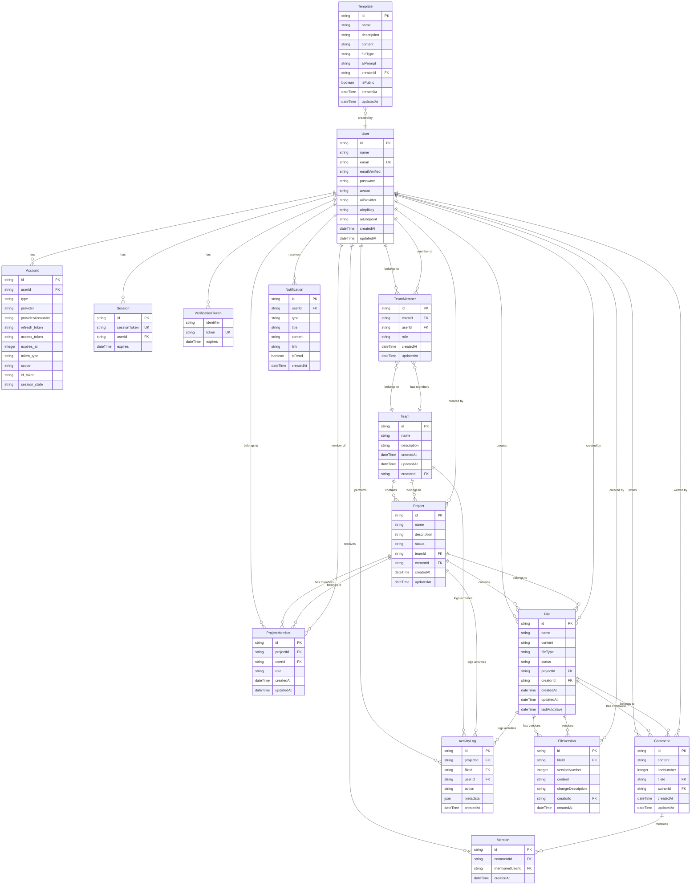

# Database Architecture - Entity Relationships

## Entity Relationship Diagram

## Database Schema Details

### User Management Tables

#### User
Core user profile with AI configuration.
- **id**: Primary key (UUID)
- **name**: User display name
- **email**: User email (unique)
- **password**: Hashed password (bcrypt)
- **avatar**: Profile picture URL
- **aiProvider**: AI provider (openai, anthropic, custom)
- **aiApiKey**: Encrypted API key
- **aiEndpoint**: Custom AI endpoint URL
- **Indexes**: email (unique), createdAt

#### Account
OAuth account linkage (for future OAuth integration).
- **Relationship**: Belongs to User
- **Indexes**: userId, provider

#### Session
User session management.
- **Relationship**: Belongs to User
- **Indexes**: sessionToken (unique), userId

### Team Management Tables

#### Team
Team entity for organizing projects.
- **id**: Primary key (UUID)
- **name**: Team name
- **description**: Team description
- **creatorId**: Foreign key to User
- **Relationships**:
  - Has many TeamMembers
  - Has many Projects
  - Has many ActivityLogs
- **Indexes**: creatorId, createdAt

#### TeamMember
Team membership with roles.
- **id**: Primary key (UUID)
- **teamId**: Foreign key to Team
- **userId**: Foreign key to User
- **role**: ADMIN | MEMBER
- **Relationships**:
  - Belongs to Team
  - Belongs to User
- **Indexes**: teamId, userId, unique(teamId, userId)

### Project Management Tables

#### Project
Project entity within teams.
- **id**: Primary key (UUID)
- **name**: Project name
- **description**: Project description
- **status**: Project status (active, archived, etc.)
- **teamId**: Foreign key to Team
- **creatorId**: Foreign key to User
- **Relationships**:
  - Belongs to Team
  - Created by User
  - Has many ProjectMembers
  - Has many Files
  - Has many ActivityLogs
- **Indexes**: teamId, creatorId, status

#### ProjectMember
Project-specific permissions.
- **id**: Primary key (UUID)
- **projectId**: Foreign key to Project
- **userId**: Foreign key to User
- **role**: ADMIN | EDITOR | VIEWER
- **Relationships**:
  - Belongs to Project
  - Belongs to User
- **Indexes**: projectId, userId, unique(projectId, userId)

### File Management Tables

#### File
Markdown files with metadata.
- **id**: Primary key (UUID)
- **name**: File name
- **content**: Markdown content
- **fileType**: File type (PROBLEM_DEFINITION, SOLUTION_DESIGN, etc.)
- **status**: File status (draft, published, archived)
- **projectId**: Foreign key to Project
- **creatorId**: Foreign key to User
- **lastAutoSave**: Last auto-save timestamp
- **Relationships**:
  - Belongs to Project
  - Created by User
  - Has many FileVersions
  - Has many Comments
  - Has many ActivityLogs
- **Indexes**: projectId, creatorId, lastAutoSave

#### FileVersion
Complete version history for files.
- **id**: Primary key (UUID)
- **fileId**: Foreign key to File
- **versionNumber**: Sequential version number
- **content**: Full file content at version
- **changeDescription**: Description of changes
- **creatorId**: Foreign key to User
- **Relationships**:
  - Belongs to File
  - Created by User
- **Indexes**: fileId, versionNumber, unique(fileId, versionNumber)

### Collaboration Tables

#### Comment
Threaded comments with line positions.
- **id**: Primary key (UUID)
- **content**: Comment content
- **lineNumber**: Line number in file
- **fileId**: Foreign key to File
- **authorId**: Foreign key to User
- **Relationships**:
  - Belongs to File
  - Written by User
  - Has many Mentions
- **Indexes**: fileId, authorId, createdAt

#### Mention
@mentions in comments.
- **id**: Primary key (UUID)
- **commentId**: Foreign key to Comment
- **mentionedUserId**: Foreign key to User
- **Relationships**:
  - Belongs to Comment
  - Belongs to User (mentioned user)
- **Indexes**: commentId, mentionedUserId

#### Notification
Real-time notifications for users.
- **id**: Primary key (UUID)
- **userId**: Foreign key to User
- **type**: Notification type (MENTION, FILE_CHANGED, etc.)
- **title**: Notification title
- **content**: Notification content
- **link**: Navigation link
- **isRead**: Read status
- **Relationships**: Belongs to User
- **Indexes**: userId, isRead, createdAt

#### ActivityLog
Comprehensive audit trail.
- **id**: Primary key (UUID)
- **projectId**: Foreign key to Project (optional)
- **fileId**: Foreign key to File (optional)
- **userId**: Foreign key to User
- **action**: Action performed (MEMBER_ADDED, FILE_UPDATED, etc.)
- **metadata**: JSON metadata
- **Relationships**:
  - Belongs to Project (optional)
  - Belongs to File (optional)
  - Performed by User
- **Indexes**: projectId, fileId, userId, action, createdAt

### Template Tables

#### Template
Reusable document templates.
- **id**: Primary key (UUID)
- **name**: Template name
- **description**: Template description
- **content**: Template content
- **fileType**: File type
- **aiPrompt**: AI prompt for generation
- **creatorId**: Foreign key to User
- **isPublic**: Public template flag
- **Relationships**: Created by User
- **Indexes**: creatorId, isPublic, fileType

## Database Relationships Summary

### Hierarchical Structure
1. **Teams** → **Projects** → **Files**
2. **Users** participate at all levels through membership tables

### Many-to-Many Relationships
1. **Users** ↔ **Teams** (via TeamMember)
2. **Users** ↔ **Projects** (via ProjectMember)

### One-to-Many Relationships
1. **Team** → **Projects**
2. **Project** → **Files**
3. **File** → **Versions**
4. **File** → **Comments**
5. **Comment** → **Mentions**
6. **User** → **Notifications**
7. **Project** → **ActivityLogs**

### Cascade Rules
- **Delete Team**: Cascades to TeamMembers, Projects (and their dependencies)
- **Delete Project**: Cascades to ProjectMembers, Files (and their dependencies)
- **Delete File**: Cascades to FileVersions, Comments, ActivityLogs
- **Delete User**: No cascade (manual cleanup required)

## Performance Indexes

### Primary Indexes
- All foreign keys
- All unique constraints
- Frequently queried fields (createdAt, updatedAt, isRead)

### Composite Indexes
- TeamMember: (teamId, userId)
- ProjectMember: (projectId, userId)
- FileVersion: (fileId, versionNumber)

### Query Optimization
- Indexes on timestamp fields for sorting
- Indexes on status fields for filtering
- Partial indexes for active/inactive records
