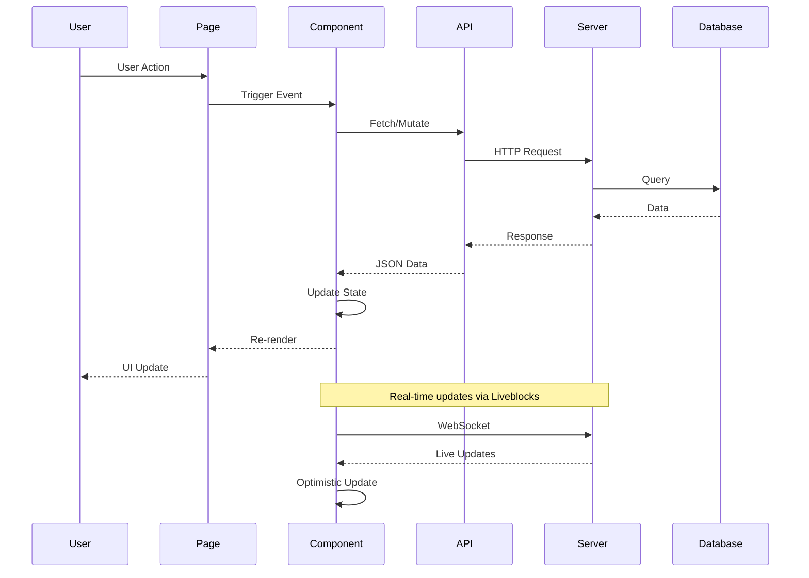
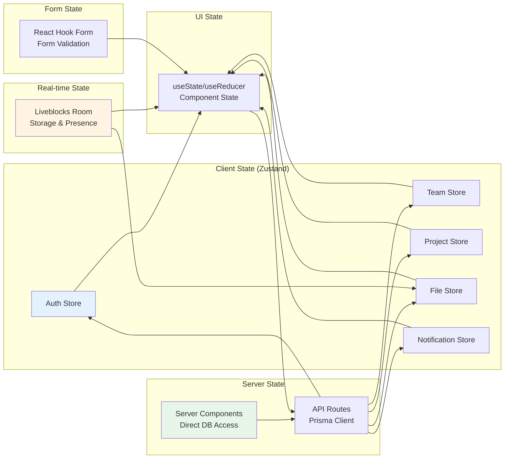
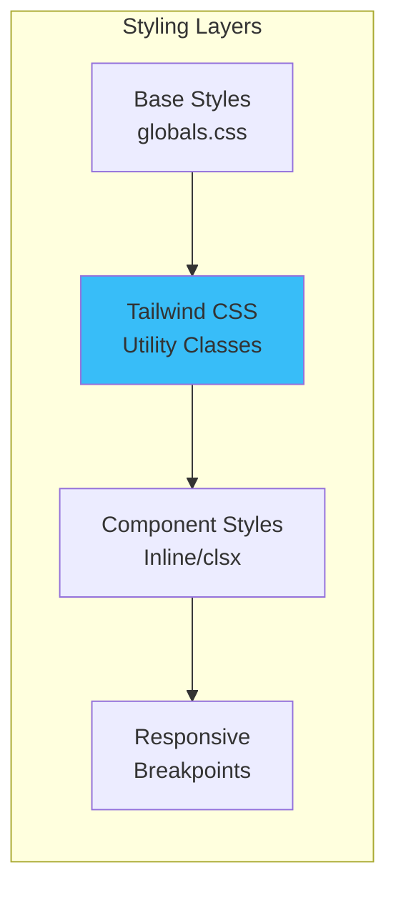

# Frontend Architecture - Component Structure

## Component Hierarchy

```mermaid
graph TB
    subgraph "Layout Components"
        DashboardLayout[DashboardLayout<br/>app/layout]
        AuthLayout[AuthLayout<br/>app/(auth)/layout]
    end

    subgraph "Dashboard Components"
        Sidebar[Sidebar]
        NotificationCenter[NotificationCenter]
        UserMenu[UserMenu]
    end

    subgraph "Feature Components"
        subgraph "Team Management"
            TeamList[TeamList]
            TeamCard[TeamCard]
            TeamDetail[TeamDetailView]
            TeamMembers[TeamMembers]
            AddTeamMember[AddTeamMember]
        end

        subgraph "Project Management"
            ProjectList[ProjectList]
            ProjectCard[ProjectCard]
            ProjectDetail[ProjectDetailView]
            ProjectMembers[ProjectMembers]
            AddProjectMember[AddProjectMember]
            CreateProject[CreateProjectDialog]
        end

        subgraph "File Management"
            FileList[FileList]
            FileCard[FileCard]
            FileDeleteButton[FileDeleteButton]
            FileUpload[FileUpload]
        end

        subgraph "Editor"
            MarkdownEditor[MarkdownEditor]
            CommentsPanel[CommentsPanel]
            CommentItem[CommentItem]
            CommentForm[CommentForm]
            EditorToolbar[EditorToolbar]
        end

        subgraph "Activity & Notifications"
            ActivityLog[ActivityLog]
            NotificationItem[NotificationItem]
            NotificationDropdown[NotificationDropdown]
        end

        subgraph "Templates"
            TemplateGallery[TemplateGallery]
            TemplateCard[TemplateCard]
            CreateFromTemplate[CreateFromTemplate]
        end
    end

    subgraph "UI Kit (Reusable)"
        Button[Button]
        Dialog[Dialog]
        Input[Input]
        Card[Card]
        Badge[Badge]
        Avatar[Avatar]
        Select[Select]
        TextArea[TextArea]
    end

    %% Layout connections
    DashboardLayout --> Sidebar
    DashboardLayout --> NotificationCenter
    Sidebar --> UserMenu

    DashboardLayout --> TeamList
    DashboardLayout --> ProjectList
    DashboardLayout --> FileList

    TeamList --> TeamCard
    TeamDetail --> TeamMembers
    TeamMembers --> AddTeamMember

    ProjectList --> ProjectCard
    ProjectDetail --> ProjectMembers
    ProjectDetail --> ActivityLog
    ProjectMembers --> AddProjectMember
    ProjectList --> CreateProject

    FileList --> FileCard
    FileCard --> FileDeleteButton

    MarkdownEditor --> EditorToolbar
    MarkdownEditor --> CommentsPanel
    CommentsPanel --> CommentItem
    CommentsPanel --> CommentForm

    NotificationCenter --> NotificationDropdown

    %% UI Kit usage (simplified)
    Button -.-> TeamCard
    Button -.-> ProjectCard
    Dialog -.-> AddTeamMember
    Dialog -.-> CreateProject

    style DashboardLayout fill:#e3f2fd
    style MarkdownEditor fill:#fff3e0
    style NotificationCenter fill:#f3e5f5
    style ActivityLog fill:#e8f5e9
```

## Page Routes Architecture

```mermaid
graph TB
    subgraph "Authentication Routes"
        Login[Login<br/>/login]
        Register[Register<br/>/register]
    end

    subgraph "Main App"
        Dashboard[Dashboard<br/>/dashboard]
        Teams[Teams<br/>/teams]
        TeamDetail[Team Detail<br/>/teams/[id]]
        Projects[Projects<br/>/projects]
        ProjectDetail[Project Detail<br/>/projects/[id]]
        Files[Files<br/>/files]
        Editor[Editor<br/>/editor/[id]]
        Templates[Templates<br/>/templates]
        Import[Import File<br/>/files/import]
    end

    subgraph "API Routes"
        AuthAPI[Auth<br/>/api/auth/*]
        TeamsAPI[Teams<br/>/api/teams/*]
        ProjectsAPI[Projects<br/>/api/projects/*]
        FilesAPI[Files<br/>/api/files/*]
        CommentsAPI[Comments<br/>/api/comments/*]
        NotificationsAPI[Notifications<br/>/api/notifications/*]
        ActivityAPI[Activity<br/>/api/activity/*]
        TemplatesAPI[Templates<br/>/api/templates/*]
        AIAPI[AI<br/>/api/ai/generate]
    end

    Login --> Dashboard
    Register --> Dashboard

    Dashboard --> Teams
    Dashboard --> Projects
    Dashboard --> Files
    Dashboard --> Templates

    Teams --> TeamDetail
    Projects --> ProjectDetail
    Files --> Editor
    Templates --> Editor
    Import --> Editor

    Dashboard --> AuthAPI
    Teams --> TeamsAPI
    Projects --> ProjectsAPI
    Files --> FilesAPI
    Editor --> CommentsAPI
    Editor --> FilesAPI
    Dashboard --> NotificationsAPI
    ProjectDetail --> ActivityAPI
    Templates --> TemplatesAPI
    Editor --> AIAPI

    style Dashboard fill:#e3f2fd
    style Editor fill:#fff3e0
    style AuthAPI fill:#f3e5f5
```

## Component Communication Patterns



## State Management Architecture



## Key Component Details

### Layout Components

#### DashboardLayout (`components/dashboard/dashboard-layout.tsx`)
- **Purpose**: Main application layout wrapper
- **Features**:
  - Responsive sidebar navigation
  - User authentication check
  - Notification center integration
  - Breadcrumb navigation
- **Usage**: Wraps all authenticated pages

#### Sidebar (`components/dashboard/sidebar.tsx`)
- **Purpose**: Main navigation menu
- **Features**:
  - Navigation links
  - User menu
  - Notification center with badge
  - Team/project quick access
- **State**: Active link tracking

### Team Management Components

#### TeamList (`components/team/team-list.tsx`)
- **Purpose**: Display all user's teams
- **Features**:
  - Grid/list view toggle
  - Create team dialog
  - Team cards with stats
- **Data**: Fetches from `/api/teams`

#### TeamMembers (`components/team/team-members.tsx`)
- **Purpose**: Manage team members
- **Features**:
  - Member list with roles
  - Add member dialog
  - Role management (admin only)
  - Remove member functionality
- **Permissions**: ADMIN only for modifications

### Project Management Components

#### ProjectList (`components/project/project-list.tsx`)
- **Purpose**: Display projects within teams
- **Features**:
  - Filter by team
  - Create project dialog
  - Project cards with member count
  - Status indicators
- **Data**: Fetches from `/api/projects`

#### ProjectMembers (`components/project/project-members.tsx`)
- **Purpose**: Manage project members
- **Features**:
  - Member list with roles
  - Add member from team
  - Role management (admin/editor)
  - Remove member functionality
- **Permissions**: EDITOR and above can add members

### Editor Components

#### MarkdownEditor (`components/editor/markdown-editor.tsx`)
- **Purpose**: Real-time collaborative markdown editor
- **Features**:
  - Liveblocks integration
  - Auto-save (30 seconds)
  - Syntax highlighting
  - Toolbar with formatting
  - Export options (PDF, DOCX)
- **Real-time**: WebSocket connection via Liveblocks

#### CommentsPanel (`components/comments/comments-panel.tsx`)
- **Purpose**: Inline commenting system
- **Features**:
  - Comment list with line numbers
  - Add comment form
  - @mention autocomplete
  - Real-time updates
- **Integration**: Right sidebar in editor

### Activity & Notifications

#### ActivityLog (`components/activity/activity-log.tsx`)
- **Purpose**: Display project activity history
- **Features**:
  - Chronological activity feed
  - Action icons and descriptions
  - User avatars
  - Timestamps with relative time
- **Data**: Fetches from `/api/activity?projectId={id}`

#### NotificationCenter (`components/notifications/notification-center.tsx`)
- **Purpose**: Real-time notification system
- **Features**:
  - Bell icon with unread badge
  - Dropdown notification list
  - Mark as read functionality
  - Auto-refresh (30 seconds)
  - Click to navigate
- **Data**: Fetches from `/api/notifications`

## Component Patterns

### 1. Server Component Pattern
```typescript
// app/teams/page.tsx
export default async function TeamsPage() {
  const teams = await db.team.findMany({
    where: {
      members: {
        some: { userId: session.user.id }
      }
    }
  })

  return <TeamList teams={teams} />
}
```
- **Usage**: Data fetching on the server
- **Benefits**: Direct database access, no client-side JS
- **Example**: Teams page, Projects page, Files page

### 2. Client Component Pattern
```typescript
// components/team/team-members.tsx
"use client"

export function TeamMembers({ teamId }: Props) {
  const [members, setMembers] = useState([])
  const fetchMembers = async () => {
    const res = await fetch(`/api/teams/${teamId}/members`)
    const data = await res.json()
    setMembers(data)
  }
  // ...
}
```
- **Usage**: Interactive features
- **Benefits**: State management, event handlers
- **Example**: Team members, Project members, Comments

### 3. Server Action Pattern
```typescript
// app/actions/teams.ts
"use server"

export async function createTeam(data: CreateTeamInput) {
  const session = await auth()
  const team = await db.team.create({
    data: {
      name: data.name,
      creatorId: session.user.id
    }
  })
  return team
}
```
- **Usage**: Mutations with form submissions
- **Benefits**: Type-safe, progressive enhancement
- **Example**: Team creation, Project creation

### 4. Compound Component Pattern
```typescript
// components/editor/markdown-editor.tsx
export function MarkdownEditor({ fileId }: Props) {
  return (
    <div className="flex h-full">
      <EditorToolbar />
      <EditorContent />
      <CommentsPanel />
    </div>
  )
}
```
- **Usage**: Complex UI with multiple parts
- **Benefits**: Composable, flexible
- **Example**: Markdown editor, Dashboard layout

## Performance Optimizations

### 1. Code Splitting
- Dynamic imports for heavy components
- Route-based splitting with Next.js App Router
- Lazy loading for modals and dialogs

### 2. Memoization
- React.memo for expensive components
- useMemo for computed values
- useCallback for event handlers

### 3. Optimistic Updates
- Update UI immediately
- Rollback on error
- Used in: Comments, Notifications, Members

### 4. Debouncing
- Auto-save with 30-second debounce
- Search input debouncing
- @mention autocomplete debouncing

### 5. Image Optimization
- Next.js Image component
- Lazy loading
- Responsive sizes

## Styling Architecture



### Tailwind CSS Usage
- **Utility-first**: No custom CSS files
- **Responsive**: Mobile-first approach
- **Theming**: Tailwind config for colors
- **Composition**: clsx for conditional classes

### Design System
- **Colors**: Blue (primary), Gray (neutral)
- **Spacing**: 4px base unit
- **Typography**: System fonts, readable sizes
- **Shadows**: Subtle, consistent
- **Border Radius**: Rounded-lg for cards

### Component Styling Pattern
```typescript
import { cn } from "@/lib/utils"

export function Button({ variant, size, className }: Props) {
  return (
    <button
      className={cn(
        "rounded-lg font-medium transition-colors",
        variant === "primary" && "bg-blue-600 text-white",
        variant === "secondary" && "bg-gray-200 text-gray-900",
        size === "sm" && "px-3 py-1.5 text-sm",
        size === "md" && "px-4 py-2 text-base",
        className
      )}
    >
      {children}
    </button>
  )
}
```
