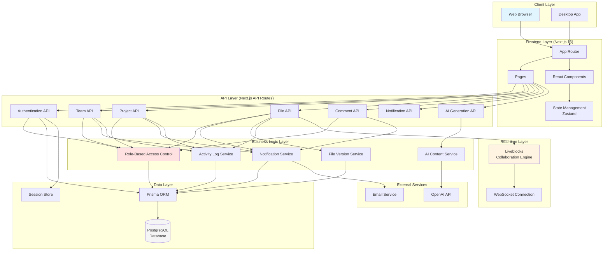
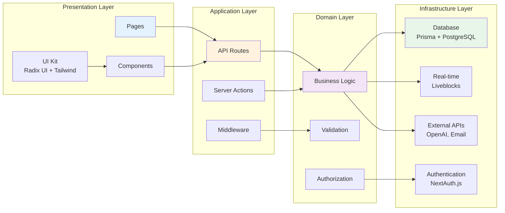
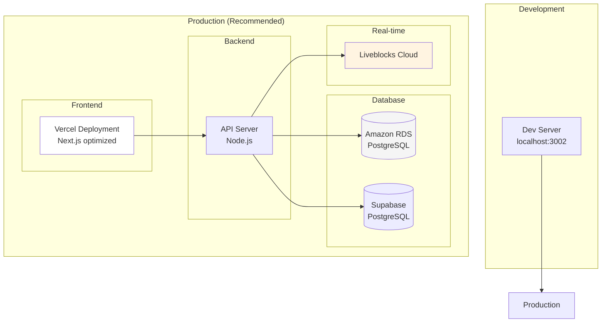
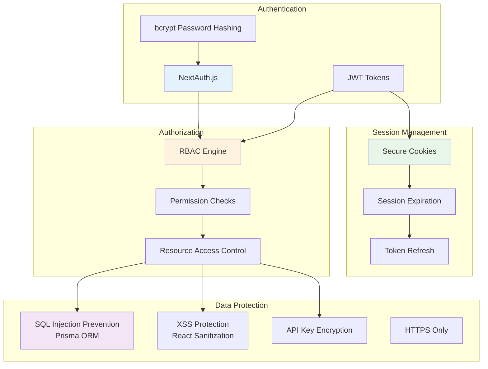

# MarqDexorative Work System - System Architecture

## High-Level System Architecture

## Layer Architecture

## Technology Stack

### Frontend
- **Framework**: Next.js 16 with App Router
- **UI Components**: Radix UI (accessible primitives)
- **Styling**: Tailwind CSS (utility-first)
- **State Management**: Zustand (client state)
- **Real-time Collaboration**: Liveblocks
- **Markdown**: react-markdown, marked, rehype plugins
- **Icons**: Lucide React

### Backend
- **Runtime**: Node.js
- **API**: Next.js API Routes
- **ORM**: Prisma
- **Database**: PostgreSQL
- **Authentication**: NextAuth.js v5
- **Password Hashing**: bcryptjs
- **Validation**: Zod

### External Services
- **AI**: OpenAI API (user-provided keys)
- **Email**: Nodemailer
- **Real-time**: Liveblocks

## Key Features & Components

### 1. Authentication System
- JWT-based authentication with NextAuth.js
- Secure password hashing with bcrypt
- Session management
- Email verification support

### 2. Authorization System (RBAC)
- **Team Roles**: ADMIN, MEMBER
- **Project Roles**: ADMIN, EDITOR, VIEWER
- Resource-level access control
- Permission checks on all API endpoints

### 3. Team Management
- Create and manage teams
- Add/remove team members
- Team member role management
- Team activity tracking

### 4. Project Management
- Projects within teams
- Project member management
- Project status tracking
- Activity logging

### 5. File Management
- Markdown file creation and editing
- File versioning and history
- Auto-save functionality
- File templates
- Import from Word documents

### 6. Real-time Collaboration
- Liveblocks integration
- Multi-user editing
- Presence indicators
- Conflict resolution

### 7. Comment System
- Inline comments
- @mentions
- Comment threading
- Real-time notifications

### 8. Notification System
- Real-time notifications
- Multiple notification types
- Notification center UI
- Mark as read functionality

### 9. Activity Logging
- Comprehensive audit trail
- Action tracking
- User activity history

### 10. AI Integration
- User-provided OpenAI API keys
- Template-based content generation
- AI-powered content enhancement
- Custom AI endpoint support

## Deployment Architecture

## Security Architecture

## Performance Optimizations

1. **Frontend**
   - Code splitting with Next.js App Router
   - Lazy loading for components
   - Image optimization
   - Debounced auto-save

2. **Backend**
   - Database connection pooling
   - Efficient Prisma queries
   - Database indexing
   - Response caching

3. **Real-time**
   - WebSocket connection pooling
   - Optimistic updates
   - Conflict resolution

4. **Database**
   - Proper indexing on foreign keys
   - Query optimization
   - Connection pooling
   - Read replicas (future)
